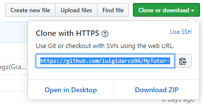

# MyTutor-FrontEnd

## 1. Requirements

- Node.js (latest should be fine)
- Git

## 2. How to download

<div style="text-align: center">

</div>

1. Copy the Git URL or click on the button next to the URL text field.
2. Open the terminal, write `git clone` and paste the git URL as shown below:

```
git clone https://github.com/luigidarco96/MyTutor-FrontEnd.git
```

3. Hit enter and it will start to download the files.

## 3. How to install

1. Navigate to the downloaded folder.
2. Open the terminal and type: `npm install`. This command will start the installation of all dipendencies.

## 4. How to start

1. Navigate to the downloaded folder.
2. Open the terminal and type: `npm start`. This command will start the server and open the browser.
